CSS Grid
========

Ths Css grid layout module offers a grid based layout system, with rows and coulumns, making it easier to design web pages without having to use floats and positioning. It easy to use and handle two dimentional layout.

Table of Content
---------------------
+ [Basic Layout](#BasicLayout)
+ [fr](#fr)
+ [repeat()](#repeat())
+ [minmax()](#minmax())
+ [auto-fit](#auto-fit)
+ [auto-fill](#auto-fill)
+ [grid-auto-row](#grid-auto-row)
+ [justify-conent](#justify-content)
+ [align-content](#align-content)
+ [justify-items](#justify-items)
+ [align-items](#align-items)
+ [justify-self](#justify-self)
+ [align-self](#align-self)
+ [grid-auto-flow](#grid-auto-flow)

BasicLayout
-----------------
First set the display property to grid then use grid property. Here some grid all property use parent div where set the display grid.

1. grid-template-columns
2. grid-template-rows
3. grid-template
4. grid-gap

### grid-template-columns

```css
    .container{
        grid-template-columns : 200px 200px ;
    }
```

here create two columns and every columns width is 200px. 

```css
    .container{
        grid-template-columns: 100px 100px 100px;
    }
```

output like

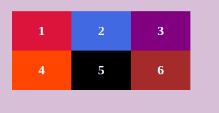

### grid-template-rows

its like grid-template-columns but it set row height.

```css
    .container{
        grid-template-columns: 100px 100px 100px;
        grid-template-rows: 300px 100px;
    }
```

output like 

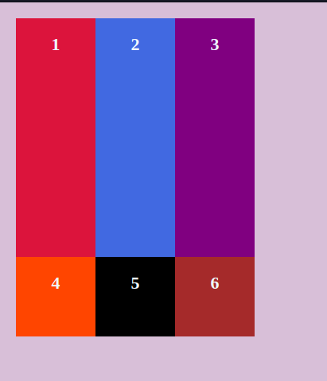

### grid-template

It shortcut way to write grid-template-rows and grid-template-columns.

*Shortcut Structure*
    grid-template: rows / colums;

Here example: 

```css
.container{
    display: grid;
    grid-template: 300px 100px / 100px 100px 100px;
}
```

This output will be same with before picture


### grid-gap
Just gap between items horizontaly and vertically. It shorthand of grid-column-gap and grid-row-gap

```css
.container{
    display: grid;
    grid-template: 1fr 1fr/ repeat(3,1fr);
    grid-gap: 10px;
}
```

output like

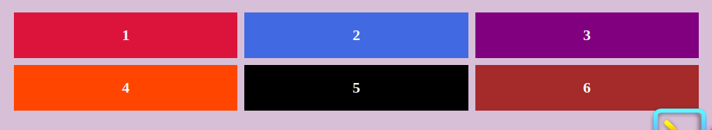

fr
===

I can you fraction in css grid. just use fr. It divide the container. 

```css
.container{
    display: grid;
    grid-template: 1fr 1fr/ 1fr 1fr 1fr;
}
```
First it divide the div horizontal by 3 time and set every div equal with. but row way can not work because .container div have no height.

output like

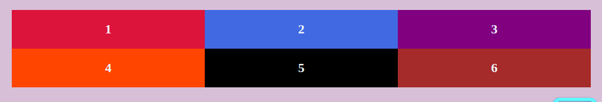;

another example

```css
.container{
    display: grid;
    height: 100%;
    grid-template: 1fr 2fr / 1fr 3fr 1fr;
}
```
output like

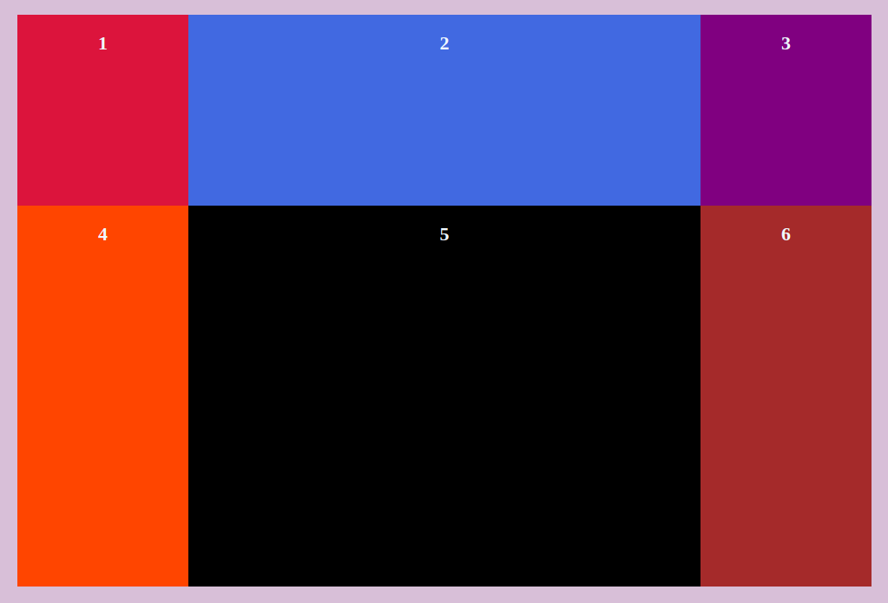

use auto for set automatic height

```css
.container{
    display: grid;
    grid-template: 1fr 2fr / 100px auto 100px;
}
```

output like

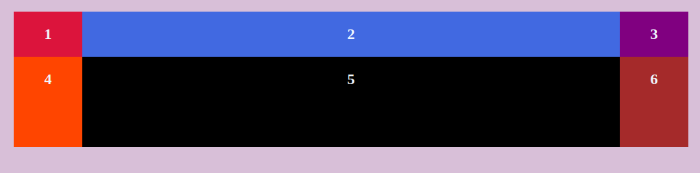

repeat()
===

repeat function reduce the code. 

    repeat(how many time repeat, size)

exapmle

```css
.container{
    display: grid;
    grid-template: repeat(2,1fr)/ repeat(3,1fr);
}
```

output like


minmax()
====
The most famous line of code to have come out of CSS grid so far is:

```css
.container{
    grid-template-columns: repeat(auto-fill, minmax(10rem, 1fr));
}
```
Without any media queries, that will set up a grid container that has a flexible number of columns. The columns will stretch a little, until there is enough room for another one, and then a new column is added, and in reverse.

The only weakness here is that first value in minmax() (the 10rem value above). If the container is narrower than whatever that minimum is, elements in that single column will overflow. Evan Minto shows us the solution with min():

auto-fit
===
These keywords tell the browser to handle the column sizing and element wrapping for us so that the elements will wrap into rows when the width is not large enough to fit them in without any overflow. The fraction unit we used also ensures that in case the width allows for a fraction of a column to fit but not a full column, that space will instead be distributed over the column or columns that already fit, making sure we aren’t left with any empty space at the end of the row

auto-fill
=====
auto-fit FITS the CURRENTLY AVAILABLE columns into the space by expanding them so that they take up any available space. The browser does that after FILLING that extra space with extra columns (as with auto-fill ) and then collapsing the empty ones.

grid-auto-row
==========

Specifies the size of any auto-generated grid tracks (aka implicit grid tracks). Implicit tracks get created when there are more grid items than cells in the grid or when a grid item is placed outside of the explicit grid. (see The Difference Between Explicit and Implicit Grids)

justify-content
==========
Sometimes the total size of your grid might be less than the size of its grid container. This could happen if all of your grid items are sized with non-flexible units like px. In this case you can set the alignment of the grid within the grid container. This property aligns the grid along the inline (row) axis (as opposed to align-content which aligns the grid along the block (column) axis).

Values:

+ start
+ end
+ center 
+ stretch
+ space-around 
+ space-between 
+ space-evenly

```css
.container {
  justify-content: start | end | center | stretch | space-around | space-between | space-evenly;    
}
```
examples

```css
.container {
  justify-content: start;
}
```

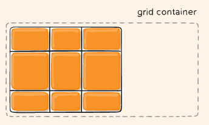


```css
.container {
  justify-content: center;    
}
```
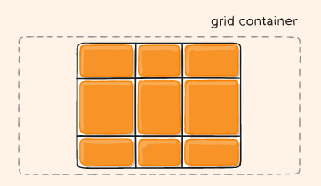

```css
.container {
  justify-content: space-around;    
}
```

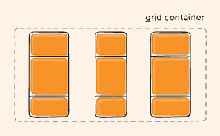

align-content
========
Sometimes the total size of your grid might be less than the size of its grid container. This could happen if all of your grid items are sized with non-flexible units like px. In this case you can set the alignment of the grid within the grid container. This property aligns the grid along the block (column) axis (as opposed to justify-content which aligns the grid along the inline (row) axis).

+ start
+ end
+ center 
+ stretch
+ space-around 
+ space-between 
+ space-evenly

```css
.container {
  align-content: center;    
}
```

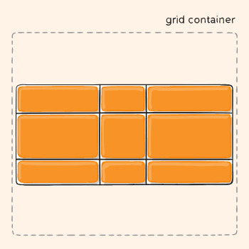

justify-items
=========

Aligns grid items along the inline (row) axis (as opposed to align-items which aligns along the block (column) axis). This value applies to all grid items inside the container.

values: 

+ start
+ end
+ center
+ stretch

```css
.container {
  justify-items: start | end | center | stretch;
}
```

example: 

```css
.container {
  justify-items: center;
}
```

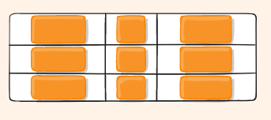

align-items
========

Aligns grid items along the block (column) axis (as opposed to justify-items which aligns along the inline (row) axis). This value applies to all grid items inside the container.

values: 
+ start
+ end
+ center
+ stretch

```css
.container {
  align-items: center;
}
```

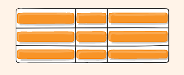

justify-self
========
Aligns a grid item inside a cell along the inline (row) axis (as opposed to align-self which aligns along the block (column) axis). This value applies to a grid item inside a single cell.

values: 
+ start
+ end
+ center
+ stretch

```css
.item {
  justify-self: start | end | center | stretch;
}
```

example:

```css
.item-a {
  justify-self: center;
}
```
output like

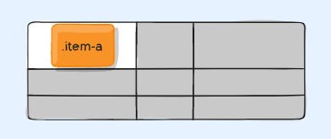

align-self
=======
Aligns a grid item inside a cell along the block (column) axis (as opposed to justify-self which aligns along the inline (row) axis). This value applies to the content inside a single grid item.

+ start
+ end
+ center
+ stretch

```css
.item {
  align-self: start | end | center | stretch;
}
```

example:
```css
.item-a {
  align-self: center;
}
```
output like

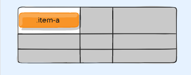

grid-auto-flow
===========

If you have grid items that you don’t explicitly place on the grid, the auto-placement algorithm kicks in to automatically place the items. This property controls how the auto-placement algorithm works.

values: 
+ row
+ column
+ dense

```css
.container {
  grid-auto-flow: row | column | row dense | column dense;
}
```

Note that dense only changes the visual order of your items and might cause them to appear out of order, which is bad for accessibility.